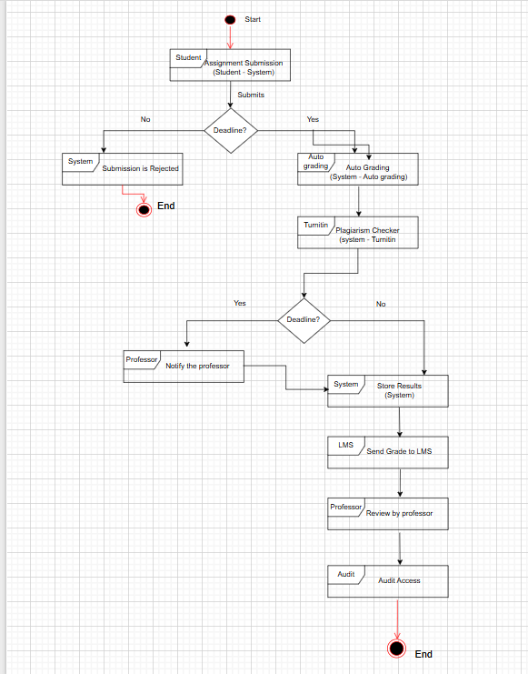
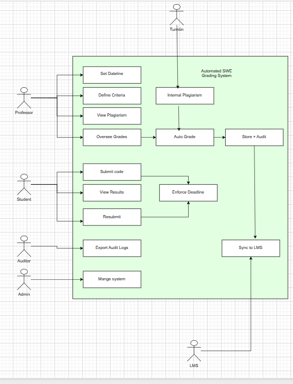
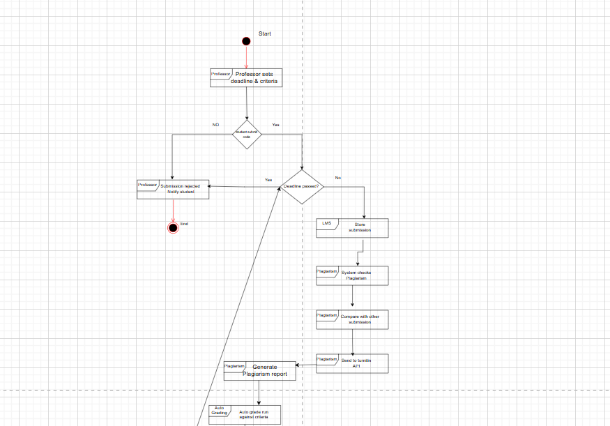
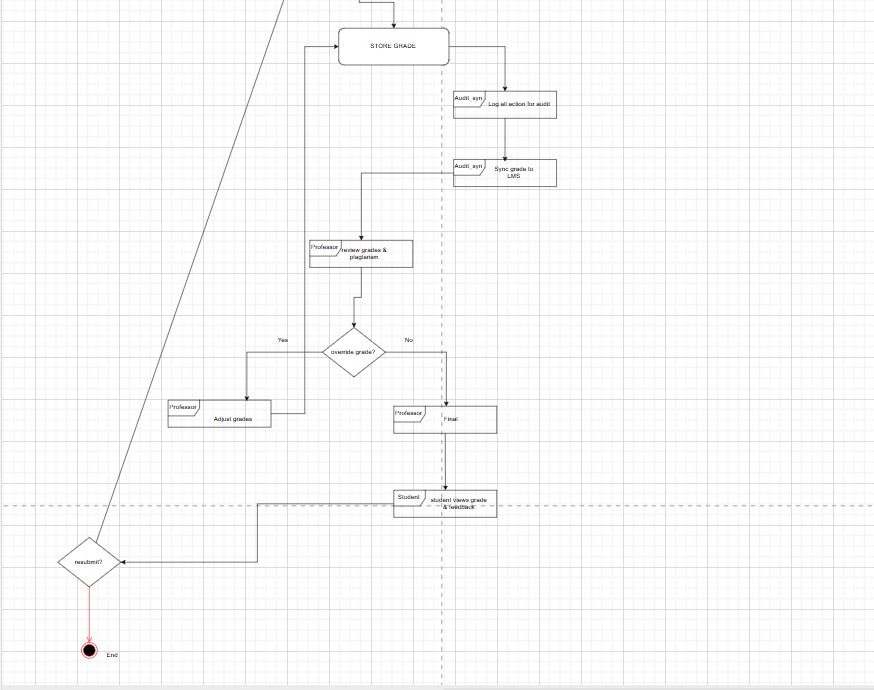

# UML & Use case Diagram
## Table of Contents
1. [Overview](#overview)
2. [Part1](#part1)
3. [Part2](#part2)
4. [part3](#part3)
5. [Conclusion](#conclusion)
6. [Link](#link)

## Overview
- This practical outlines the design of an automated grading system for programming assignments in a university Sotfware Engineering course. Where system is intended to replace the current manual process and address the challenges of scalling to 300+ student per year.Key goals include automation of grading, plagiarism detection, integration with university learing management system.

- The design is presentend through three complementary diagram:

## Part1
###  Interaction Overview(IoD) from an Actor-to-Actor perspective

### Explanation
- The diagram shows that the business outcome relies on a closed loop where the professor defines the rules, students submit code within the deadline, the system performs automated grading and plagiarism checking (via Turnitin), and finally pushes the results to the LMS. An auditor can later review the complete audit trail. This view abstracts away system internals, focusing solely on actor‑to‑actor interactions.

## Part2
The Use Case Diagram defines the system boundary and the specific functionalities that support the interactions identified above. Actors include the human roles (Professor, Student, Auditor) and external systems (Turnitin, LMS).

### Explanation
- Professor defines due date/time and grading criteria.
- Student uploads source code; multiple attempts allowed until deadline.
- System rejects submissions after the deadline.
- System compiles and runs code against the defined criteria, producing a provisional grade.
- System compares submission against other submissions and sends code to Turnitin for similarity analysis.
- Student sees final grade and detailed feedback
- After finalization, grades are pushed to the mainframe‑based LMS.

## Part3
- This diagram combines the previous views, showing how actors interact through the system to accomplish the business outcome. It uses a swimlane format to clarify responsibilities.

### Explanation
The sequence diagram illustrates the full flow:
- Professor configures the assignment upfront.
- Students submit multiple times; the system enforces the deadline and runs auto‑grading plus Turnitin checks after each submission.
- Professor reviews all results, makes final adjustments, and triggers the grade sync to the LMS (which is mainframe‑based but only requires a one‑way push).
- Auditor can independently retrieve the audit log at any time

- This design ensures that every action (submission, grading, plagiarism check, grade finalization, sync) is logged, satisfying the auditability requirement.

## Conclusion
##### The proposed Automated SWE Grading System addresses the university’s needs for scalability, integrity, and auditability while respecting budget and infrastructure constraints. The three diagrams illustrate:
**Actor‑to‑actor interactions that drive the business outcome.**
**Functional decomposition into clear use cases.**
**System‑level interactions that realise those use cases in a coordinated workflow.**

- By automating grading and plagiarism detection, the system frees professors from repetitive manual work, provides students with rapid feedback, and maintains a complete audit trail for regulatory compliance. This design forms a solid foundation for implementation within the university’s existing ecosystem

## Link
- Deepseek: https://chat.deepseek.com/a/chat/s/c5cf15d4-1ff0-44f3-b3ca-ba08805b0f55 
- Draw.io: https://app.diagrams.net#G1Ir7RZhGqwMTBU94pyYJyxGOqjMZN1DBI#%7B%22pageId%22%3A%22MYZbLemxwOWpdsTyfFYM%22%7D

