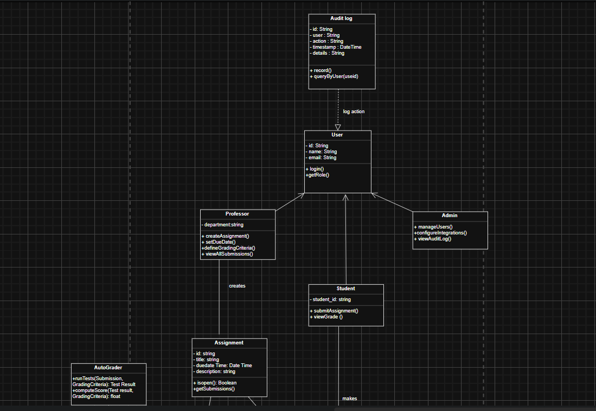
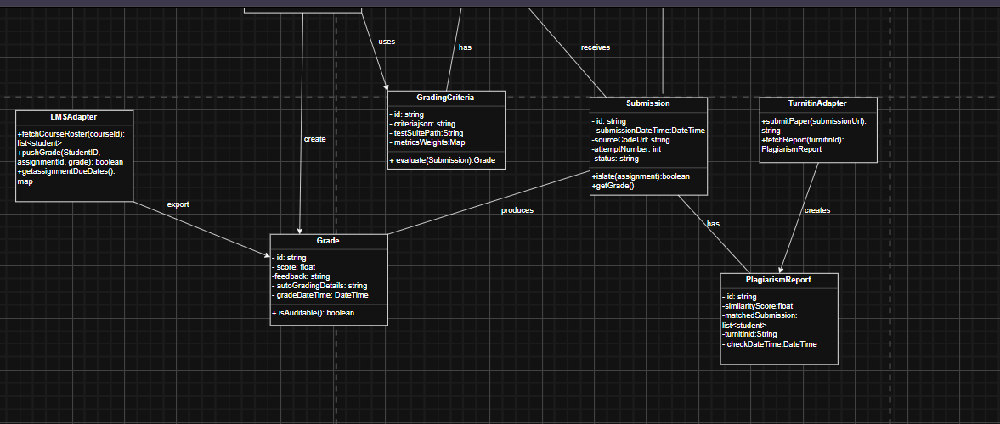
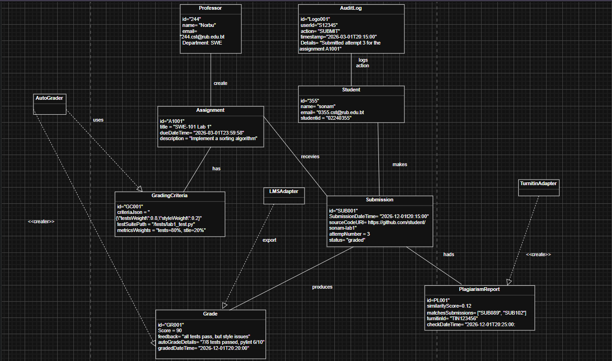

# Class diagram & Object model
# Table of Contents
1. [Overview](#overview)
2. [Class_Diagram](#class_diagram)
3. [object_Diagram](#object_diagram)
4. [Challenges](#challenges)
5. [Lesson](#lesson_learn)
6. [Conclusion](#conclusion)
7. [Reference](#reference)
8. [link](#link)

## Overview
- The following is a report on the architecture of the design for an automatic grading and plagiarism checking system for the SWE class at the university. The design should be able to handle over 300 students every year, accommodate multiple submissions, have deadlines enforced, interoperate with the current mainframe-based LMS (requiring minimal modifications), have complete audit trails for the State inspectors, and also plagiarism detection (internal + TurnItIn) – on a shoestring IT budget.

- In order to convey the static structure and a specific running example of the system under consideration, two kinds of UML diagrams will be employed  **class diagrams** and **object diagrams** (or object models).

## class_Diagram
- class diagram is a blueprint of the system static structure.

##### Relationships 
**Inheritance**: `Student`, `Professor`, `Admin`and `User`.
- Professor creates Assignment
- Assignment has GradingCriteria
- Student submits Submission
- Submission produces Grade
- LMSAdapter exports Grade
- TurnitinAdapter creates PlagiarismReport
- AutoGrader uses GradingCriteria

## object_diagram
  - is a snapshot of the system at a specific moment.
  

##### Relationships
- Student makes submission(attempt 3)
- Assignment has GradingCriteria
- Submission produces Grade
- submission has PlagiarismReport
- AutoGrader uses GradingCriteria and then creates grade
- TurnitinAdapter creates plagiarismReport
- LMSAdapter Exports Grade
- AuditLog logs action for student

## challenges
- I felt very hard to understanding the differences betweeen a class diagram and an object model as at first i mixed the value all together inside the class diagram and i forgot to add methods in the object model where it took me serveral attempts to separate between blueprint and snapshot. Also i felt very hard in identifying all the required classes from the requirements as the case study mentioned has many feature where i missed my initial class diagram so i had to redraw the diagram. 

## lesson_learn
1. **Audit logs should be planned from day one** – It is difficult to retro fit auditability into a project. Having an immutable, timestamped log is easy and complies with regulations.

2. **Multiple attempts are not a bug; rather they are a feature** – Allow students multiple tries without storing unnecessary data. The benefits outweigh the cost by far.

3. **Loose coupling using adaptors** – With isolation of the LMS and TurnItIn behind adaptor layers, the internal grading logic will never need revision no matter how external systems evolve.

4. **Describe the runtime snapshot** – A description of object graph in textual format can be very useful when trying to explain the system behavior to the profs.

## Conclusion
- Class Diagram and Object Model describe a comprehensive and economical solution to meet all of the required criteria. Automation of grade checking will involve the use of free test runners, and AuditLog will ensure persistent and traceable grades. Plagiarism will be checked internally and via TurnItIn under a cost constraint. Integration of Learning Management System will be done via batch files without touching the mainframe code. Deadline is set using Assignment.dueDateTime, and Submission.attemptNumber allows an unlimited number of tries. Grade rules can be configured flexibly by defining them in JSON format. 

## reference
- GeeksforGeeks. (2025, August 29). Unified modeling language (UML) class diagrams.
https://www.geeksforgeeks.org/unified-modeling-language-uml-class-diagrams/

- GeeksforGeeks. (2025, January 3). Unified modeling language (UML) object diagrams.
https://www.geeksforgeeks.org/system-design/unified-modeling-language-uml-object-diagrams/

## Link
- draw.io: https://app.diagrams.net/#
